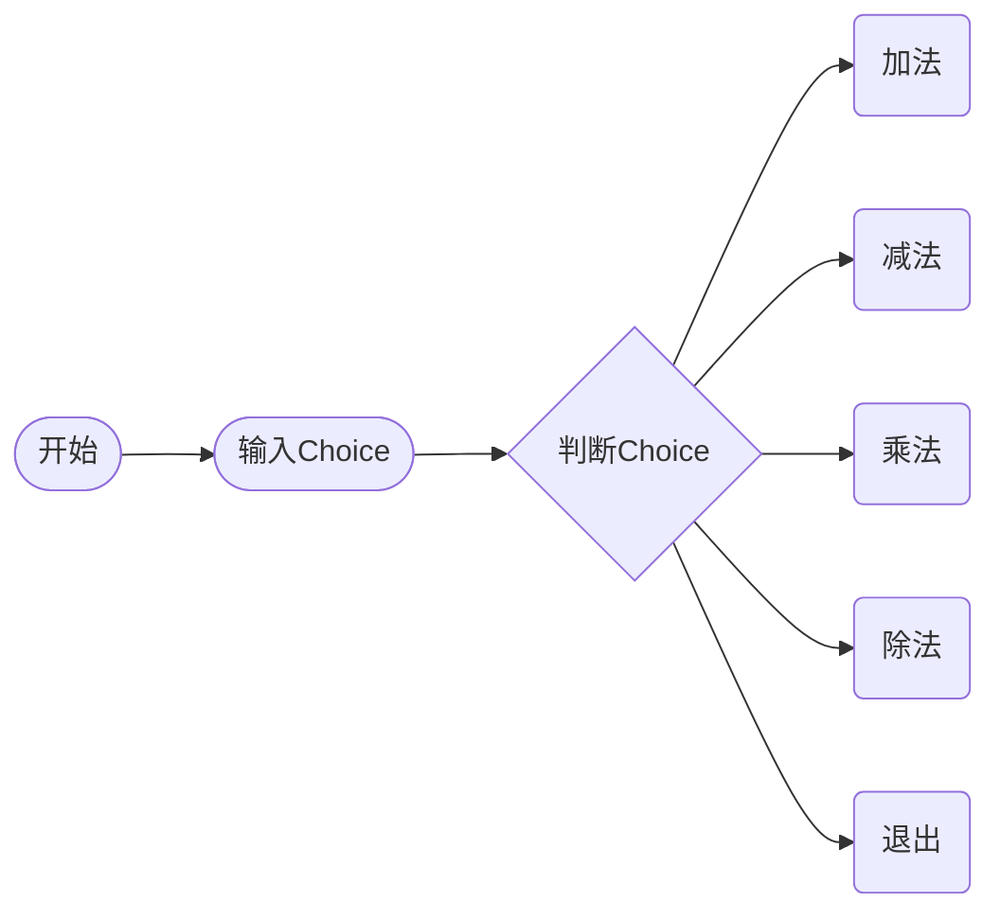

# 分支结构

在 1.2-2 的程序中，已经完成了四则运算程序界面的输出，需要**分支结构**来选择需要的选项



此时需要`if`语句来进行选择

```c
if (条件){
}
```

## 编写一个分段函数

编写输出如下分段函数值的程序，要求整数$x$的值从键盘输入

$$
y=\left\{  
     \begin{array}{lr}  
     x+1(x\leq0)  \\  
     1(0<x\leq3) \\  
     x (x>3)&  
     \end{array}  
\right.
$$

对于程序，我们可以绘制一个流程图


详见1.4-2.c
