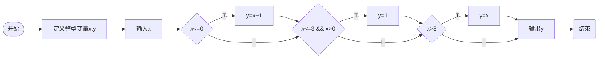
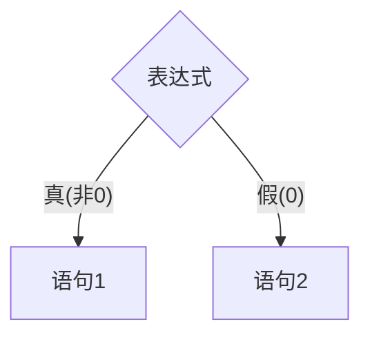
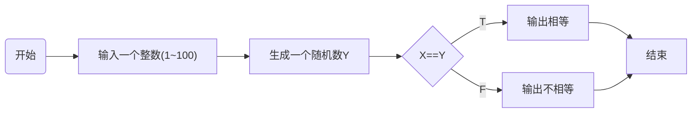
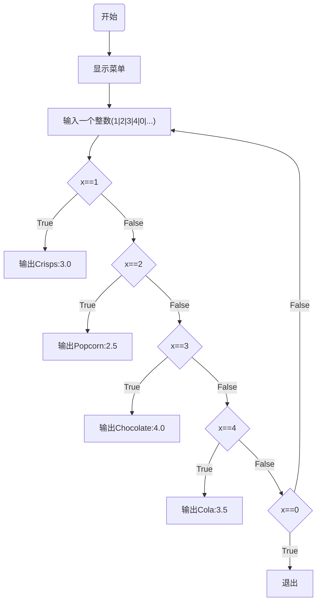

# 分支结构

在 1.4-1 的程序中，已经完成了四则运算程序界面的输出，需要**分支结构**来选择需要的选项


此时需要`if`语句来进行选择

```c
if (条件){
}
```

## 编写一个分段函数

编写输出如下分段函数值的程序，要求整数$x$的值从键盘输入

$$
y=\left\{  
     \begin{array}{lr}  
     x+1(x\leq0)  \\  
     1(0<x\leq3) \\  
     x (x>3)&  
     \end{array}  
\right.
$$

对于程序，我们可以绘制一个流程图



详见1.4-2.c

## if-else语句



语法如下

```c
if (条件表达式){
  语句1;
  语句2;
}
else{
  语句3;
  语句4
}
```

### 实战:猜数游戏

输入你所猜的整数(1~100)，与计算机产生的被猜数比较，若相等，显示猜中；若不等，显示没猜中

流程图如下：



## if-else if语句(多分支结构)

分支结构可以被嵌套.

### 实战:显示商品价格

假设自动售货机出售4种商品，薯片(crisps)、爆米花(popcorn)、巧克力(chocolate)、可乐(cola)，售价分别是每份3.0、2.5、4.0和3.5元，用户选择商品后显示商品价格。



## `switch`多分支语句

```c
switch(表达式){
  case 常量表达式1: 语句段1;break;
  ……
  case 常量表达式n: 语句段n;break;
  default:  语句段n+1;
}

```

### 注意

* [ ]  `break;`不添加的话，被执行的`case`语句下面的所有语句都将被执行。用于强制退出目前的语句块(`switch`结构中的)
* [ ]  所有语句不执行时，会执行默认语句
