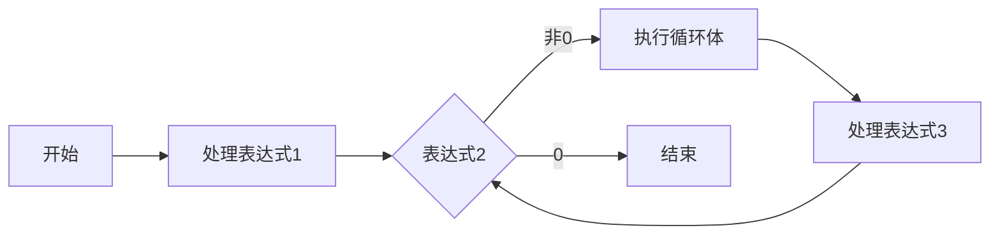

# 循环

## `while`循环

`while`语句的一般形式

```c
while (表达式){
	循环体
}
```

### 例题

从键盘中输入若干个学生成绩，求它们的和

见2.1-1.c

## `for`循环

`for`语句的一般形式

```c
for (表达式1;表达式2;表达式3){
	循环体
}
```

`for`语句的执行过程



### 例

求$n!$

$$
n!=1·2·3·......·n
$$

见2.1-2.c，注意:`fac`应该声明为 `long long`;`%lld`

### 例

求$2+4+6+...+100$的值

见2.1-3.c

### 例

在3~100之间所有3的倍数中，找出个位数为2的数

见2.1-4.c

## `do while`循环

```c
do{
    循环体
}while (表达式);
```

### 例

从键盘输入若干个学生成绩，求它们的和

见2.1-5.c

### 例

从键盘读入一个整数，统计该数的位数
